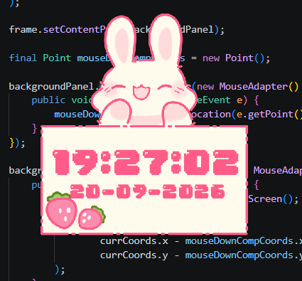
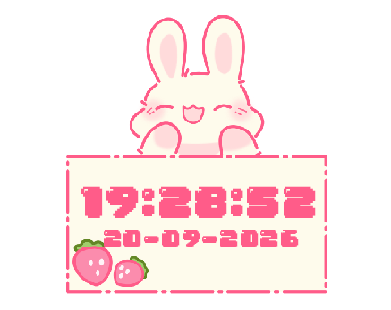

# BunnyClock
A small, cute desktop clock built with Java Swing that displays the current time and date in a simple bunny-themed widget.

The project is designed as a portable Windows desktop application. You can download it, run it, and use it without installing Java or any additional dependencies.

## ✨ Features
- 🐰 Cute bunny-themed desktop widget
- 🕐 Displays the current time
- 📅 Displays the current date
- 🪟 Lightweight desktop window
- 📦 Portable — no installation required
- ☕ Includes its own Java runtime
- 💻 No Java/JDK installation required on the user's computer

## 🛠️ Built With
- Java
- Java Swing
- Launch4j

## How It Works
The application was developed as a Java desktop program using Swing. 

The Java program is first compiled into a .jar file. Launch4j is then used to create a Windows .exe launcher for the application. The distributed package also contains the required Java runtime, so users don't need to install a JDK or JRE separately. The .exe launches the Java application using the included runtime.

**Windows only**: The current release is packaged as a Windows executable.

## Running From Source
If you want to experiment with the source code, you'll need a Java development environment.

## 🎯 Why I Made This
I was bored. This was a small personal project to learn more about Java desktop application development, Swing, threads, and packaging Java applications for distribution.
This project is mainly a learning/personal project and may receive improvements or small changes in the future. If you have any suggestions, let me know. 

